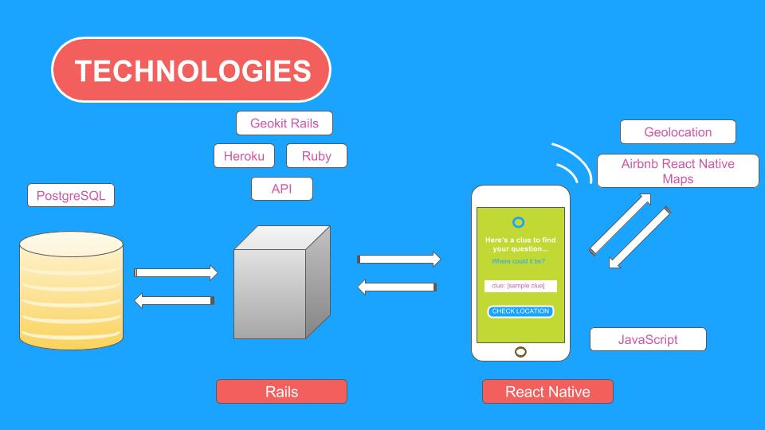

# QuestionAmble (Front End)

QuestionAmble is a React Native mobile application that allows users to create and play quests with location-based questions. Players who embark on a quest need to locate where each question is based and, once found, try to guess the answer. The game is over when the player has correctly answered all the questions for the quest. When this happens, the player is shown their results. The focus of this app is knowledge by exploring the physical world!

This is the front-end component of our project. Although we had one week to design and program the initial version that was demoed, there may be updates from time to time. This is not a commercial application.

Information regarding the QuestionAmble Back End can be found [here](https://github.com/nyc-rock-doves-2017/QuestionAmble-BE).

### Table of Contents
- [Team Members](#Team Members)
- [Program Structure](#Program Structure)
- [Design Decisions](#Design Decisions)
- [User Interactions](#User Interactions)
- [Live Demo](#Live Demo)
- [Resources](#Resources)

#### Team Members
* Wan Tsui - *[GitHub: wantsui](https://github.com/wantsui)*
* Kelsey Malone - *[GitHub: kqm001](https://github.com/kqm001)*
* Kevin Cross - *[GitHub: Kevinhcross96](https://github.com/Kevinhcross96)*
* Rahat Alam - *[GitHub: rahat64](https://github.com/rahat64)*

#### Program Structure

The front end is programmed in React Native and calls on the back end to access and store data.

#### Design Decisions
1. Since QuestionAmble is a game that requires players to be mobile, the application itself needed to be mobile. React Native was chosen so that our team could create a mobile application using JavaScript that would eventually be compatible with both Android and iOS.
2. An API that React Native apps have access to is the Geolocation API. The original vision for the application involved AR, but due to time constraints, geolocation was used instead. See the resources below to learn more about geolocation and React Native!
3. To show the quest creators a visual representation of their location, Airbnb's React Native Maps was used.
4. To store and extract information, we used Rails with Postgres as the back-end. By treating Rails as an API, the React Native application just needed to be concerned with working with the data provided.
5. React Navigation, specifically stack navigator, was used to allow the user to navigate to different screens and view different pieces of information.

#### User Interactions
The app was designed so that a user can be both a quest creator and player. As a result, users have the following options when interacting with the application:
1. User (General)
  - A user can sign up for an account.
  - A user can log in to an account.
  - A user can log out.
  - A user can either create a quest or play a quest.
2. Quest Creation
  - A user provides a title/description when creating an new quest.
  - A user can create a geolocation based question for a quest.
  - A user can get a game key that is unique to the quest and share the key with others.
  - A user can see the players that attempted the quest.
3. Player
  - A user can start a new game by entering a game key.
  - A user can only answer a question if near a predetermined location.
  - If a user gets a question incorrectly, the user can try to answer again.
  - Once all the questions have been answered, a user can see results.

#### Live Demo

*Link coming soon!*

#### Resources
1. [React Native](https://facebook.github.io/react-native/)
2. [MDN web docs - "Geolocation"](https://developer.mozilla.org/en-US/docs/Web/API/Geolocation)
3. [MDN web docs - "Using geolocation"](https://developer.mozilla.org/en-US/docs/Web/API/Geolocation/Using_geolocation)
4. [React Native - "Geolocation"](https://facebook.github.io/react-native/docs/geolocation.html)
5. [Airbnb - "React Native Maps"](https://github.com/airbnb/react-native-maps)
6. [React Navigation](https://reactnavigation.org/)
7. [React Navigation GitHub](https://github.com/react-community/react-navigation)
8. [React Navigation GitHub Issue: "How to pass `initialProps` to a StackNavigator screen? #876"](https://github.com/react-community/react-navigation/issues/876)

*This README is still in progress. Check back soon for more updates!*
